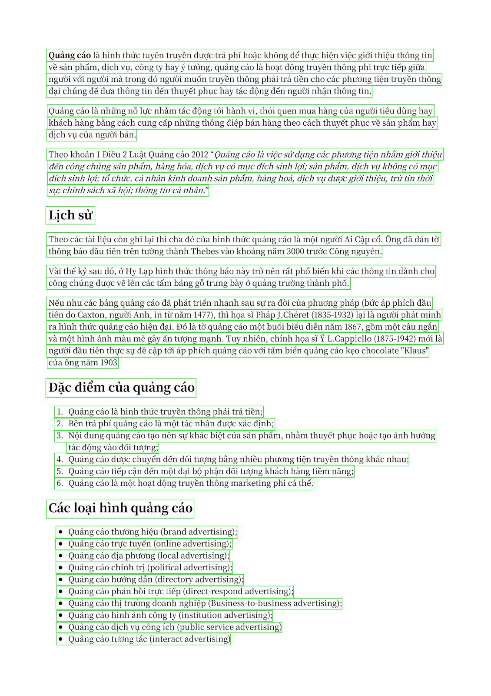

# Vietnamese Ocr Error Correction Toolbox
This project provides a set of tools to correct OCR errors in Vietnamese text. The project currently supports four features: OCR corrector, address corrector, letter case corrector, and datetime corrector.
## Table of Contents
  - [Features](#features)
  - [Installation](#installation)
  - [Usage](#usage)
  - [Appendix](#appendix)

## Features
### 1. OCR Corrector
The OCR Corrector uses a seq2seq or transformer model to predict the most likely correction for OCR errors in Vietnamese text. It is statistically proved that OCR errors skew significantly towards wrong-diacritics for Vietnamese. For that reason, the OCR Corrector focuses mainly on diacritics correction problem. See the [appendix](#appendix) section for more details. The code used for this feature is heavily based on [this tutorial](https://viblo.asia/p/thu-ap-dung-mo-hinh-dich-may-vao-bai-toan-tu-dong-sua-loi-tieng-viet-maGK7vJB5j2).
<ul>
    <details>
        <summary>See it in action</summary>
        Before: 
        <blockquote>
            Sau khi có y kien của Phó thủ tướng Trần Hồng Hà, UBND tinh Đồng Nai đồng ý gia han 4 mỏ đất phục vụ đắp nền cho tuyen cao tốc chạy qua địa bàn
        </blockquote> 
        After:
        <blockquote>
            Sau khi có ý kiến của Phó thủ tướng Trần Hồng Hà, UBND tỉnh Đồng Nai đồng ý gia hạn 4 mỏ đất phục vụ đắp nên cho tuyến cao tốc chạy qua địa bàn
        </blockquote> 
    </details>
</ul>

### 2. Address Corrector
The Address Corrector uses a Trie to identify and correct common mistakes in Vietnamese addresses. The Trie data structure was prefered over a Dictionary-based approach because of its efficiency. The Trie was built by Vietnamese addresses data from [vietnam_dataset](https://github.com/thien0291/vietnam_dataset).
<ul>
    <details>
        <summary>See it in action</summary>
        Before: 
        <blockquote>
            16.5 C/C 4 Nguyễn Đinh Chieu Đa Kao, Quận 1, TP HoChí Minh
        </blockquote> 
        After:
        <blockquote>
            16.5 C/C 4 Nguyễn Đình Chiểu, Phường Đa Kao, Quận 1, Thành Phố Hồ Chí Minh
        </blockquote> 
    </details>
</ul>

### 3. Letter Case Corrector
The Lettercase Corrector uses heuristics to identify and correct common mistakes in Vietnamese letter case. The letter case errors are mainly resulted from characters that have similar shape in uppercase and lowercase such as `C`, `O`, and `S`.
<ul>
    <details>
        <summary>See it in action</summary>
        Before: 
        <blockquote>
            tôi có một CƠ SỞ sản xuất bún đậu mắm tôm
        </blockquote> 
        After:
        <blockquote>
            tôi có một cơ sở sản xuất bún đậu mắm tôm
        </blockquote> 
    </details>
</ul>

### 4. Datetime Corrector
The datetime corrector uses heuristics to identify and correct common mistakes in Vietnamese datetime string. The targeted datetime string is widely used on various forms of documents such as Vietnamese National ID Card, Vietnames Driver's License, and Vietnamese public documents.
<ul>
    <details>
        <summary>See it in action</summary>
        Before: 
        <blockquote>
            ngày /date 01 tháng /month 04 năm/year 2022
        </blockquote> 
        After:
        <blockquote>
            01/04/2022
        </blockquote> 
    </details>
</ul>

## Installation
```
git clone https://github.com/buiquangmanhhp1999/VietnameseOcrCorrection.git
pip install -r requirements.txt
```
## Usage
The main.py file provide a sample snippet to use the project.
```python
from main import Corrector
corrector = Corrector(kwargs_address=address_corrector_cfg,kwargs_ocr=ocr_corrector_cfg)
corrector(text, mode)
```
The corrector call method accept two arguments: the text to correct, and the correction mode. The correction mode can be one of the following: "ocr", "address", "lettercase", or "datetime".

## Appendix

[Survey of Post-OCR Processing Approaches, University of La Rochelle](https://dl.acm.org/doi/10.1145/3453476) statiscally shown that the text errors from human typing and ocr output have different distributions. Briefly, human is more likely to produce shorter, non-existen, and space-missing words while OCR output tend to be longer, more real-world, and space-reduntant.

| OCR | Human |
| :---: | :---: |
| 59.21% real-word error​​ (Hoàng → Hoàn)​ | 67.5 % non-word error​​ (Hoàng → Hoàgn) |
| 2.36x higher incorrect split error​​ (Hoàng → Ho àng)​​  | 6.5x higher run-on error​​ (Hoàng hôn → Hoànghôn)​​  |
| 42.1% short-word error​​  | 67.5% short-word error​​  |

The distribution of error acts as the input and is essential to the performance of the Ocr Correction model, hence, demanding a statiscal study on Vietnamese OCR output error. 

Using 214 document pages (549799 characters ~ 137643 words) crawled from [Vietnamese wikipedia](https://vi.wikipedia.org/wiki/Trang_Ch%C3%ADnh), I learned that almost 60% correctable Vietnamese OCR errors caused by losing or wrong diacritics. See the [Exploratory data analysis report](assets/EDA_VietnameseOcrError_report.pptx) for more details.

A sample document page crawled from Vietnamese wikipedia:
 

